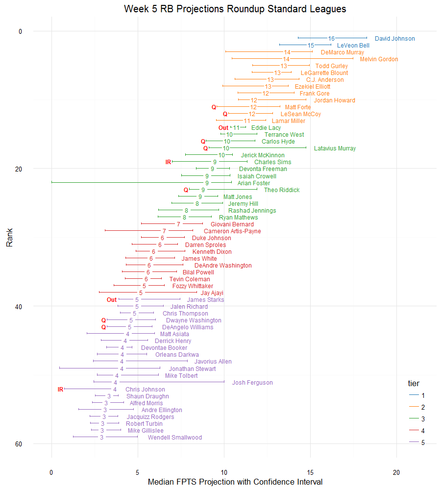
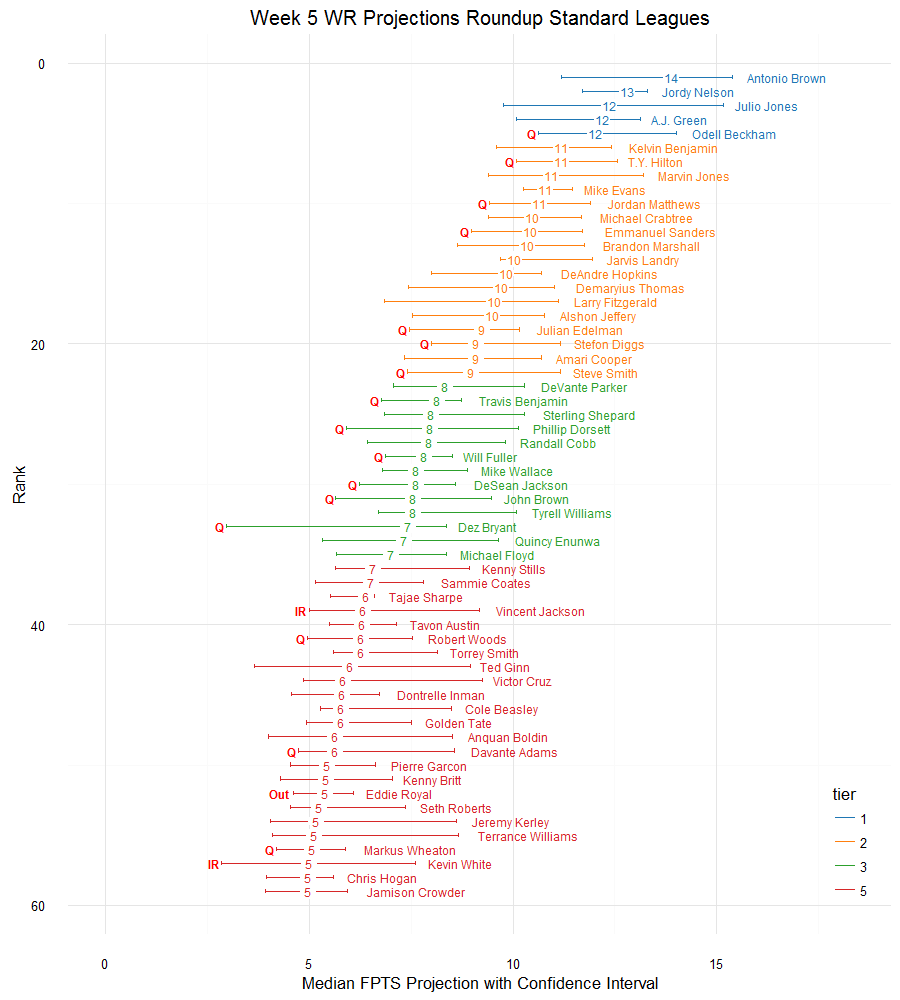
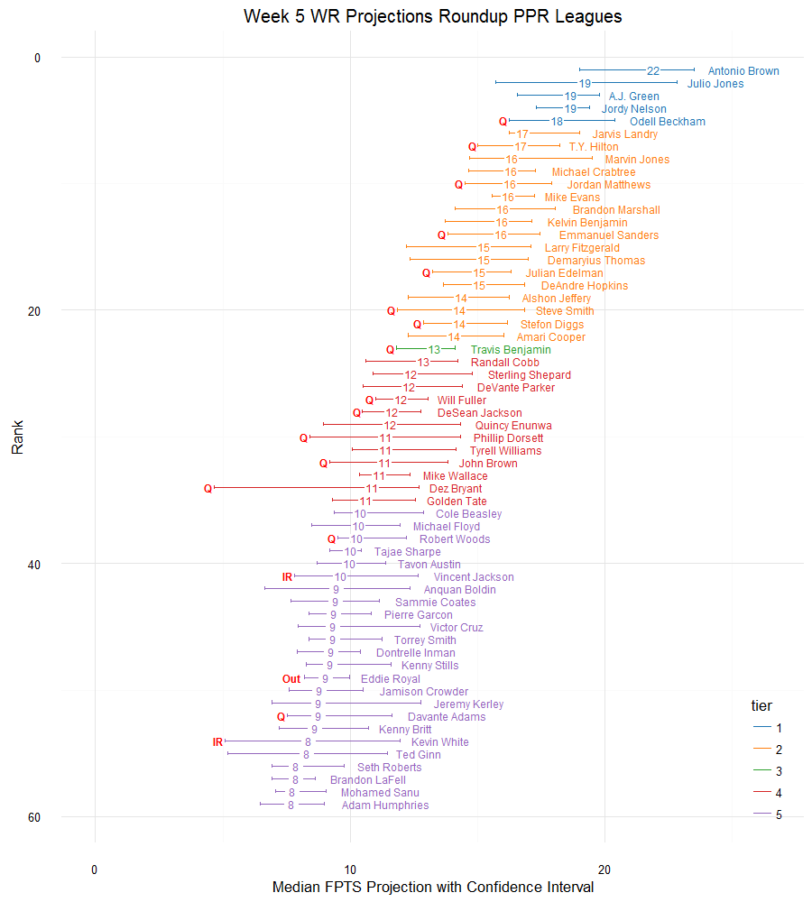
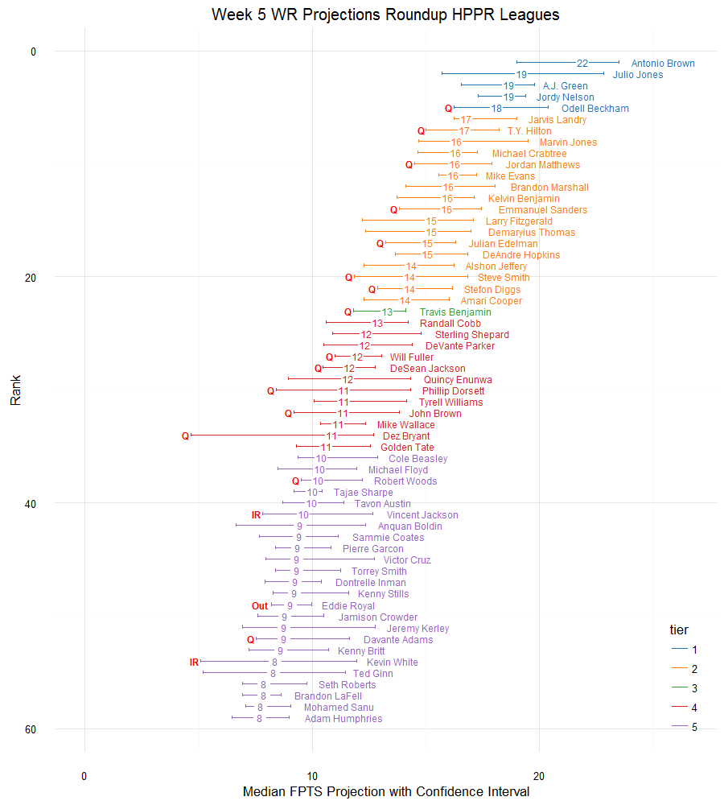
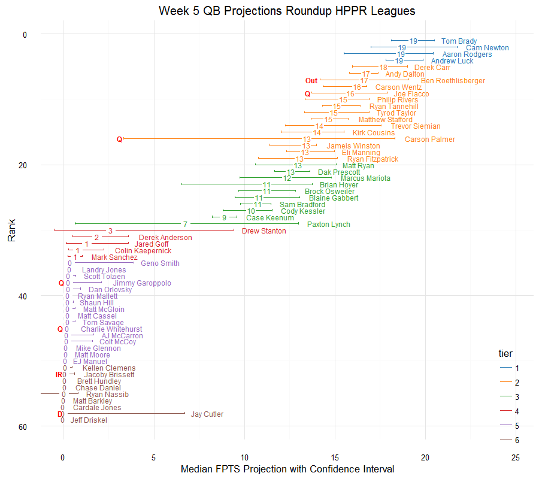
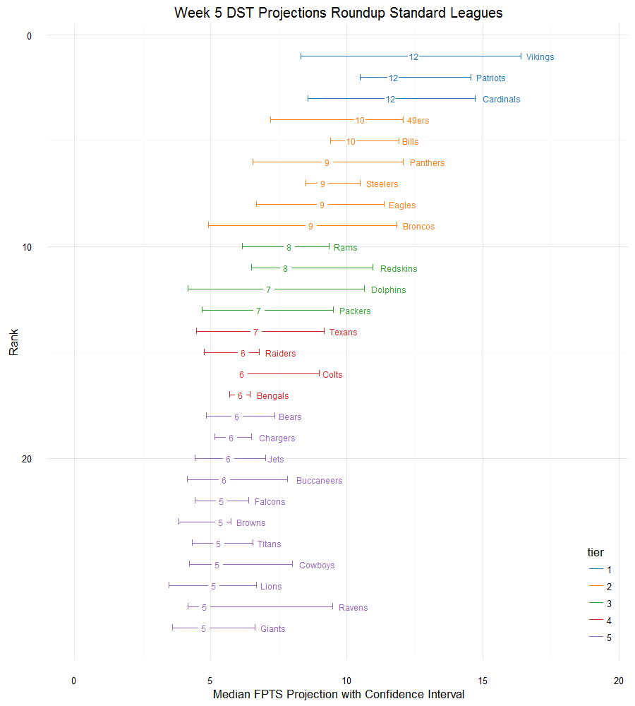
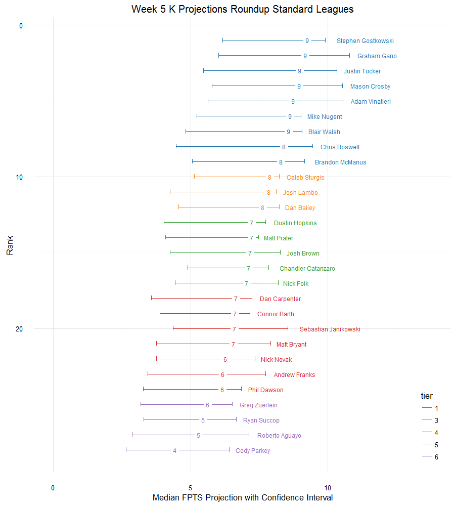

# Example Roundup
Michael Griebe  
October 20, 2016  

Welcome to week 5. The graphs below summarize the projections from a variety of sources.  This week&rsquo;s summary includes projections from: CBS: CBS Average, Yahoo Sports, NFL, FantasySharks, ESPN, FantasyFootballNerd and FantasyPros.  The data for this article was collected on 10/20/16. For more details on WR gold mining and how to interpret the graphs above, see [Chad&rsquo;s post explaining gold mining](http://fantasyfootballanalytics.net/2014/11/gold-mining-explained.html).

## Projection Table
<!--html_preserve-->

<!--/html_preserve-->

## Projection Graphs Standard Leagues  {.tabset .tabset-pills}
### RB
#### Standard Scoring League Running Backs

From the graph below notice that:
  
- Melvin Gordon, Latavius Murray, Jay Ajayi, Javorius Allen and Josh Ferguson are the five players
 with the <b>largest upside</b> (as measured from their (pseudo)medians). For these players,
 some projections are placing much higher valuations than others. 
 If you are projected to lose this week by quite a few points and
 are looking for a risky play that may tip the balance in your favor,
 these are players to consider.
- Terrance West, Theo Riddick, Shaun Draughn, Alfred Morris and Jacquizz Rodgers are the players with the 
    <b> smallest downside</b>, which suggests that while their median projection might
    not be great, there is less uncertainty concerning how poorly they may perform.  So,
    if you are likely to win by a lot and want to reduce your downside risk, these
    players may deserve extra attention.
- On the other hand, DeMarco Murray, Melvin Gordon, Arian Foster, Cameron Artis-Payne and Jonathan Stewart are the five players with the <b>largest downside</b> this week.  If you are 
    planning on starting them, it may be prudent to investigate why some projections have 
    such low expectations for these players.

 
<!-- -->

  
  
### WR
#### Standard Scoring League Wide Receiver 
  
From the graph below notice that:

- Ted Ginn, Victor Cruz, Davante Adams, Jeremy Kerley and Terrance Williams are the five players
 with the <b>largest upside</b> (as measured from their (pseudo)medians). For these players,
 some projections are placing much higher valuations than others. 
 If you are projected to lose this week by quite a few points and
 are looking for a risky play that may tip the balance in your favor,
 these are players to consider.
- Mike Evans, Jarvis Landry, Torrey Smith, Cole Beasley and Seth Roberts are the players with the 
    <b> smallest downside</b>, which suggests that while their median projection might
    not be great, there is less uncertainty concerning how poorly they may perform.  So,
    if you are likely to win by a lot and want to reduce your downside risk, these
    players may deserve extra attention.
- On the other hand, Antonio Brown, Julio Jones, Larry Fitzgerald, Dez Bryant and Ted Ginn are the five players with the <b>largest downside</b> this week.  If you are 
    planning on starting them, it may be prudent to investigate why some projections have 
    such low expectations for these players.

 
<!-- -->

  
### QB
#### Standard Scoring League Quarterback
  
From the graph below notice that:
  
- Cam Newton, Trevor Siemian, Carson Palmer, Brian Hoyer and Paxton Lynch are the five players
 with the <b>largest upside</b> (as measured from their (pseudo)medians). For these players,
 some projections are placing much higher valuations than others. 
 If you are projected to lose this week by quite a few points and
 are looking for a risky play that may tip the balance in your favor,
 these are players to consider.
- Andrew Luck, Andy Dalton, Ryan Tannehill, Dak Prescott and Case Keenum are the players with the 
    <b> smallest downside</b>, which suggests that while their median projection might
    not be great, there is less uncertainty concerning how poorly they may perform.  So,
    if you are likely to win by a lot and want to reduce your downside risk, these
    players may deserve extra attention.
- On the other hand, Aaron Rodgers, Carson Palmer, Marcus Mariota, Brian Hoyer and Paxton Lynch are the five players with the <b>largest downside</b> this week.  If you are 
    planning on starting them, it may be prudent to investigate why some projections have 
    such low expectations for these players.

<!-- -->

  
### TE
#### Standard Scoring League Tight-End
  
From the graph below notice that:
  
- Cameron Brate, Hunter Henry, Richard Rodgers, Austin Seferian-Jenkins and Garrett Celek are the five players
 with the <b>largest upside</b> (as measured from their (pseudo)medians). For these players,
 some projections are placing much higher valuations than others. 
 If you are projected to lose this week by quite a few points and
 are looking for a risky play that may tip the balance in your favor,
 these are players to consider.
- Dwayne Allen, Charles Clay, Lance Kendricks, Will Tye and Ryan Griffin are the players with the 
    <b> smallest downside</b>, which suggests that while their median projection might
    not be great, there is less uncertainty concerning how poorly they may perform.  So,
    if you are likely to win by a lot and want to reduce your downside risk, these
    players may deserve extra attention.
- On the other hand, Rob Gronkowski, Tyler Eifert, Hunter Henry, Austin Seferian-Jenkins and Jordan Cameron are the five players with the <b>largest downside</b> this week.  If you are 
    planning on starting them, it may be prudent to investigate why some projections have 
    such low expectations for these players.

<!-- -->

  
  
## Projection Graphs Point-per-Reception Leagues  {.tabset .tabset-pills} 
### RB
#### Point-per-Reception League Running Back Roundup
  
  From the graph below notice that:
  
- Melvin Gordon, Latavius Murray, Arian Foster, Javorius Allen and Josh Ferguson are the five players
 with the <b>largest upside</b> (as measured from their (pseudo)medians). For these players,
 some projections are placing much higher valuations than others. 
 If you are projected to lose this week by quite a few points and
 are looking for a risky play that may tip the balance in your favor,
 these are players to consider.
- Jordan Howard, Terrance West, Chris Thompson, Devontae Booker and Shaun Draughn are the players with the 
    <b> smallest downside</b>, which suggests that while their median projection might
    not be great, there is less uncertainty concerning how poorly they may perform.  So,
    if you are likely to win by a lot and want to reduce your downside risk, these
    players may deserve extra attention.
- On the other hand, DeMarco Murray, Melvin Gordon, Arian Foster, Cameron Artis-Payne and Jonathan Stewart are the five players with the <b>largest downside</b> this week.  If you are 
    planning on starting them, it may be prudent to investigate why some projections have 
    such low expectations for these players.

 
<!-- -->

  
  
### WR
#### Point-per-Reception League Wide Receiver
  
From the graph below notice that:
  
- Julio Jones, Marvin Jones, Victor Cruz, Jeremy Kerley and Ted Ginn are the five players
 with the <b>largest upside</b> (as measured from their (pseudo)medians). For these players,
 some projections are placing much higher valuations than others. 
 If you are projected to lose this week by quite a few points and
 are looking for a risky play that may tip the balance in your favor,
 these are players to consider.
- Jarvis Landry, Mike Evans, Mike Wallace, Robert Woods and Mohamed Sanu are the players with the 
    <b> smallest downside</b>, which suggests that while their median projection might
    not be great, there is less uncertainty concerning how poorly they may perform.  So,
    if you are likely to win by a lot and want to reduce your downside risk, these
    players may deserve extra attention.
- On the other hand, Julio Jones, Larry Fitzgerald, Phillip Dorsett, Dez Bryant and Ted Ginn are the five players with the <b>largest downside</b> this week.  If you are 
    planning on starting them, it may be prudent to investigate why some projections have 
    such low expectations for these players.

 
<!-- -->

  
  
### QB
#### Point-per-Reception League Quarterback
  
From the graph below notice that:
  
- Cam Newton, Trevor Siemian, Carson Palmer, Brian Hoyer and Paxton Lynch are the five players
 with the <b>largest upside</b> (as measured from their (pseudo)medians). For these players,
 some projections are placing much higher valuations than others. 
 If you are projected to lose this week by quite a few points and
 are looking for a risky play that may tip the balance in your favor,
 these are players to consider.
- Andrew Luck, Andy Dalton, Ryan Tannehill, Dak Prescott and Case Keenum are the players with the 
    <b> smallest downside</b>, which suggests that while their median projection might
    not be great, there is less uncertainty concerning how poorly they may perform.  So,
    if you are likely to win by a lot and want to reduce your downside risk, these
    players may deserve extra attention.
- On the other hand, Aaron Rodgers, Carson Palmer, Marcus Mariota, Brian Hoyer and Paxton Lynch are the five players with the <b>largest downside</b> this week.  If you are 
    planning on starting them, it may be prudent to investigate why some projections have 
    such low expectations for these players.

<!-- -->

  
### TE
#### Point-per-Reception League Tight-End
  
From the graph below notice that:
  
- Hunter Henry, Antonio Gates, Richard Rodgers, Dion Sims and Trey Burton are the five players
 with the <b>largest upside</b> (as measured from their (pseudo)medians). For these players,
 some projections are placing much higher valuations than others. 
 If you are projected to lose this week by quite a few points and
 are looking for a risky play that may tip the balance in your favor,
 these are players to consider.
- Kyle Rudolph, Jason Witten, Ryan Griffin, Darren Fells and Crockett Gillmore are the players with the 
    <b> smallest downside</b>, which suggests that while their median projection might
    not be great, there is less uncertainty concerning how poorly they may perform.  So,
    if you are likely to win by a lot and want to reduce your downside risk, these
    players may deserve extra attention.
- On the other hand, Hunter Henry, Tyler Eifert, Antonio Gates, Austin Seferian-Jenkins and Trey Burton are the five players with the <b>largest downside</b> this week.  If you are 
    planning on starting them, it may be prudent to investigate why some projections have 
    such low expectations for these players.

<!-- -->

## Projection Graphs Half-Point-per-Reception Leagues  {.tabset .tabset-pills} 
### RB
#### Half-Point-per-Reception League Running Back Roundup
  
  From the graph below notice that:
  
- Melvin Gordon, Latavius Murray, Arian Foster, Javorius Allen and Josh Ferguson are the five players
 with the <b>largest upside</b> (as measured from their (pseudo)medians). For these players,
 some projections are placing much higher valuations than others. 
 If you are projected to lose this week by quite a few points and
 are looking for a risky play that may tip the balance in your favor,
 these are players to consider.
- Jordan Howard, Terrance West, Chris Thompson, Devontae Booker and Shaun Draughn are the players with the 
    <b> smallest downside</b>, which suggests that while their median projection might
    not be great, there is less uncertainty concerning how poorly they may perform.  So,
    if you are likely to win by a lot and want to reduce your downside risk, these
    players may deserve extra attention.
- On the other hand, DeMarco Murray, Melvin Gordon, Arian Foster, Cameron Artis-Payne and Jonathan Stewart are the five players with the <b>largest downside</b> this week.  If you are 
    planning on starting them, it may be prudent to investigate why some projections have 
    such low expectations for these players.

 
<!-- -->

  
  
### WR
#### Half-Point-per-Reception League Wide Receiver
  
From the graph below notice that:
  
- Julio Jones, Marvin Jones, Victor Cruz, Jeremy Kerley and Ted Ginn are the five players
 with the <b>largest upside</b> (as measured from their (pseudo)medians). For these players,
 some projections are placing much higher valuations than others. 
 If you are projected to lose this week by quite a few points and
 are looking for a risky play that may tip the balance in your favor,
 these are players to consider.
- Jarvis Landry, Mike Evans, Mike Wallace, Robert Woods and Mohamed Sanu are the players with the 
    <b> smallest downside</b>, which suggests that while their median projection might
    not be great, there is less uncertainty concerning how poorly they may perform.  So,
    if you are likely to win by a lot and want to reduce your downside risk, these
    players may deserve extra attention.
- On the other hand, Julio Jones, Larry Fitzgerald, Phillip Dorsett, Dez Bryant and Ted Ginn are the five players with the <b>largest downside</b> this week.  If you are 
    planning on starting them, it may be prudent to investigate why some projections have 
    such low expectations for these players.

 
<!-- -->

  
  
### QB
#### Half-Point-per-Reception League Quarterback
  
From the graph below notice that:
  
- Cam Newton, Trevor Siemian, Carson Palmer, Brian Hoyer and Paxton Lynch are the five players
 with the <b>largest upside</b> (as measured from their (pseudo)medians). For these players,
 some projections are placing much higher valuations than others. 
 If you are projected to lose this week by quite a few points and
 are looking for a risky play that may tip the balance in your favor,
 these are players to consider.
- Andrew Luck, Andy Dalton, Ryan Tannehill, Dak Prescott and Case Keenum are the players with the 
    <b> smallest downside</b>, which suggests that while their median projection might
    not be great, there is less uncertainty concerning how poorly they may perform.  So,
    if you are likely to win by a lot and want to reduce your downside risk, these
    players may deserve extra attention.
- On the other hand, Aaron Rodgers, Carson Palmer, Marcus Mariota, Brian Hoyer and Paxton Lynch are the five players with the <b>largest downside</b> this week.  If you are 
    planning on starting them, it may be prudent to investigate why some projections have 
    such low expectations for these players.

<!-- -->

  
### TE
#### Half-Point-per-Reception League Tight-End
  
From the graph below notice that:
  
- Hunter Henry, Antonio Gates, Richard Rodgers, Dion Sims and Trey Burton are the five players
 with the <b>largest upside</b> (as measured from their (pseudo)medians). For these players,
 some projections are placing much higher valuations than others. 
 If you are projected to lose this week by quite a few points and
 are looking for a risky play that may tip the balance in your favor,
 these are players to consider.
- Kyle Rudolph, Jason Witten, Ryan Griffin, Darren Fells and Crockett Gillmore are the players with the 
    <b> smallest downside</b>, which suggests that while their median projection might
    not be great, there is less uncertainty concerning how poorly they may perform.  So,
    if you are likely to win by a lot and want to reduce your downside risk, these
    players may deserve extra attention.
- On the other hand, Hunter Henry, Tyler Eifert, Antonio Gates, Austin Seferian-Jenkins and Trey Burton are the five players with the <b>largest downside</b> this week.  If you are 
    planning on starting them, it may be prudent to investigate why some projections have 
    such low expectations for these players.

<!-- -->

## Projection Graphs Defense/Special Teams and Kickers  {.tabset .tabset-pills}
### DST
#### Standard Scoring DST

From the graph below notice that:
  
- Vikings, Broncos, Redskins, Dolphins and Ravens are the five players
 with the <b>largest upside</b> (as measured from their (pseudo)medians). For these players,
 some projections are placing much higher valuations than others. 
 If you are projected to lose this week by quite a few points and
 are looking for a risky play that may tip the balance in your favor,
 these are players to consider.
- Steelers, Colts, Bengals, Chargers and Ravens are the players with the 
    <b> smallest downside</b>, which suggests that while their median projection might
    not be great, there is less uncertainty concerning how poorly they may perform.  So,
    if you are likely to win by a lot and want to reduce your downside risk, these
    players may deserve extra attention.
- On the other hand, Vikings, Cardinals, 49ers, Broncos and Dolphins are the five players with the <b>largest downside</b> this week.  If you are 
    planning on starting them, it may be prudent to investigate why some projections have 
    such low expectations for these players.

 
<!-- -->

### K
#### Standard Scoring K

From the graph below notice that:
  
- Graham Gano, Adam Vinatieri, Sebastian Janikowski, Roberto Aguayo and Cody Parkey are the five players
 with the <b>largest upside</b> (as measured from their (pseudo)medians). For these players,
 some projections are placing much higher valuations than others. 
 If you are projected to lose this week by quite a few points and
 are looking for a risky play that may tip the balance in your favor,
 these are players to consider.
- Chandler Catanzaro, Sebastian Janikowski, Ryan Succop, Roberto Aguayo and Cody Parkey are the players with the 
    <b> smallest downside</b>, which suggests that while their median projection might
    not be great, there is less uncertainty concerning how poorly they may perform.  So,
    if you are likely to win by a lot and want to reduce your downside risk, these
    players may deserve extra attention.
- On the other hand, Justin Tucker, Mike Nugent, Blair Walsh, Chris Boswell and Josh Lambo are the five players with the <b>largest downside</b> this week.  If you are 
    planning on starting them, it may be prudent to investigate why some projections have 
    such low expectations for these players.

 
<!-- -->

  
