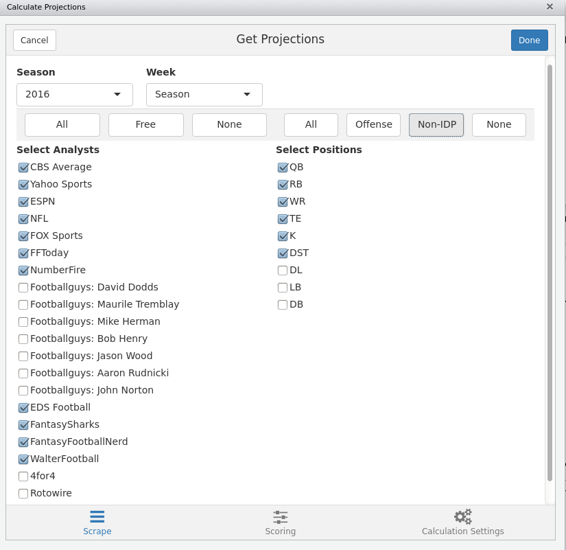

# Introduction
We are continously trying to provide users ways to replicate results and provide insights to what we are doing in terms of providing data. To streamline this process we have now build an R package that includes a streamlined version of the scripts used to scrape data and calculate projected points. It is the intent for the pacakge to be used like other packages. 

# Installation
Right now the package is only available through our GitHub repository, and installation requires that you have already installed the `devtools` package. You can then install the package via
```{r eval= FALSE}
devtools::install_github("dadrivr/FantasyFootballAnalyticsR", subdir = "RPackage/ffanalytics")
```
There is also a [tarball](https://github.com/dadrivr/FantasyFootballAnalyticsR/RPackage/) available in the GitHub repository that you can download and install with `install.packages`. After the package is installed you can then use `library(ffanalytics)` to attach the package.

## Package manual
The package includes a reference manual in standard package format. You can also find this in the help pane in RStudio. The full PDF version of the manual is [here](https://github.com/dadrivr/FantasyFootballAnalyticsR/blob/master/RPackage/ffanalytics/ffanalytics.pdf)

# Addins
The `ffanalytics` package includes a couple of [RStudio addins](http://rstudio.github.io/rstudioaddins/) to help you processing with data. To be able to fully take advandtage of this you will need to run RStudio (v0.99.878 or later). The first addin `Run Scrape` will just execute a data scrape while `Run Projections` will execute the data scrape as well as calculate projected points. The addins will construct code and return them to the console in RStudio to be executed.

## Run Projections addin
The `Run Projection` addin consists of three tabs that you will need to review before running the projections. 

### Sources and positions
When you start the projections addin you should see the tab where you can select which sources and positions you want to use. Note that this includes the ability to use subscription based sources but you will need to either download the data separately or provide user name and password for those sites. Also, set the period you want to scrape for. Note that historical data scrapes are nearly impossible to do as sites usually don't store their historical projections.


# Execute R code
